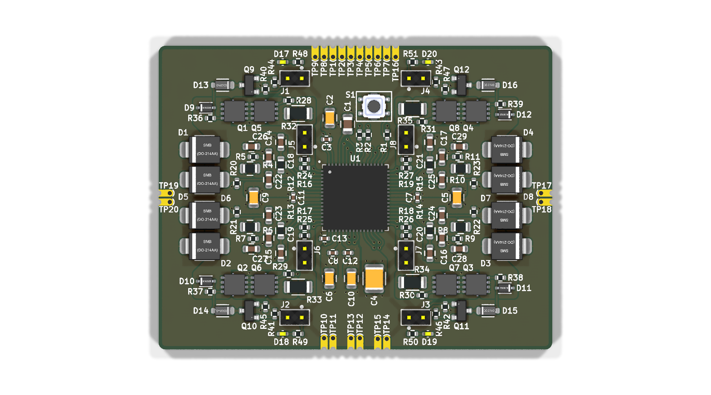
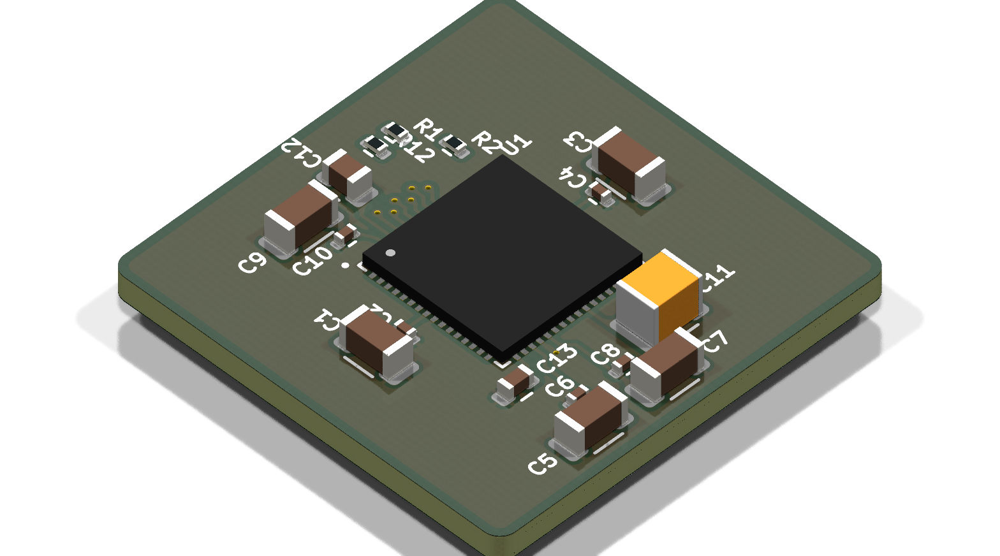

# Minimal_AD74416H

## Overview

This repository contains a minimal KiCad design project for the Analog Devices AD74416H, a quad-channel, software-configurable input and output device with HART modem capabilities. The project includes schematic designs and PCB layout files for implementing this versatile analog I/O device.

## About the AD74416H

The AD74416H is a highly integrated, 16-bit, quad-channel, software-configurable input/output device designed for process control applications. Key features include:

- Quad-channel configurable analog I/O
- Software-selectable input/output modes:
  - 0 V to 10 V voltage output
  - 0 mA to 24 mA current output
  - 0 mA to 20 mA current output
  - ±10 V voltage input
  - 0 mA to 24 mA current input
  - Resistance measurement (RTD)
  - Digital input/output
- Integrated HART modem for communication
- High precision 16-bit DACs and ADCs
- Wide supply voltage range
- Integrated diagnostic features
- Compact 64-pin LFCSP package

## Project Structure

```
minimal_ad74416h/
├── minimal_ad74416h.kicad_sch       # Main schematic file
├── minimal_ad74416h.kicad_pcb       # PCB layout file
├── minimal_ad74416h.kicad_pro       # Project configuration file
├── fp-lib-table                     # Footprint library table
├── sym-lib-table                    # Symbol library table
├── Front End Channel 1.kicad_sch    # Channel-specific schematic
├── docs/                            # Documentation files
│   ├── pictures/                    # Images and photos
│   └── schematics/                  # Schematic PDF exports
└── KiCAD_Symbols_Generator/         # Submodule for symbol generation from CSV data
```

## Features

This design provides a minimal implementation of the AD74416H with:

- Proper power supply connections
- Reference voltage generation
- Basic channel configuration
- HART communication interface
- Standard footprint for the 64-pin LFCSP package

## Getting Started

### Prerequisites

- [KiCad EDA](https://www.kicad.org/) version 9.0 or later installed on your system
- Git (for cloning the repository and submodule management)

### Opening the Project

1. **Clone the repository** (including submodules):
   ```bash
   git clone --recursive https://github.com/your-username/Minimal_AD74416H.git
   ```
   
   If you've already cloned the repository without submodules, initialize them with:
   ```bash
   git submodule init
   git submodule update
   ```

2. **Open the project in KiCad**:
   - Launch KiCad
   - Click "Open Existing Project"
   - Navigate to the cloned repository folder
   - Select the `minimal_ad74416h.kicad_pro` file

3. **Explore the design**:
   - Open the schematic editor to view the circuit design
   - Open the PCB editor to view the board layout
   - Review the symbol and footprint libraries used in the design

### Project Files

- **Main schematic**: `minimal_ad74416h.kicad_sch` - Contains the primary circuit design
- **PCB layout**: `minimal_ad74416h.kicad_pcb` - Physical board design file
- **Project configuration**: `minimal_ad74416h.kicad_pro` - KiCad project settings

## Symbol Generator Submodule

This project includes the KiCAD_Symbols_Generator as a submodule, which provides tools for generating KiCad symbols from CSV data files. For more information on using this tool, see the [KiCAD_Symbols_Generator documentation](minimal_ad74416h/KiCAD_Symbols_Generator/README.md).

## Documentation

The `docs` folder contains:
- Schematic PDF exports
- Images and photos of the design

## Visuals

Here are some images of the PCB design:


*Top View of the PCB*


*Side View of the PCB*

## License

This project is licensed under the MIT License - see the [LICENSE](LICENSE) file for details.

## References

- [AD74416H Datasheet](https://www.analog.com/media/en/technical-documentation/data-sheets/ad74416h.pdf)
- [KiCad EDA](https://www.kicad.org/)